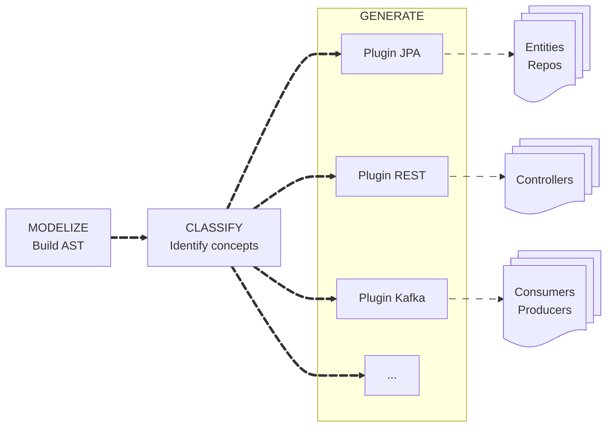

# HexaGlue

***Focus on business code, not infrastructure glue.***

---

> [!WARNING]
> **Work in Progress** — HexaGlue is under active development and already functional. 
> APIs may still evolve, and the project is not yet considered production-ready.

---

## The Problem

Hexagonal Architecture promises clean separation between business logic and infrastructure. In practice, developers spend countless hours writing repetitive adapter code: JPA entities mirroring domain objects, repositories implementing port interfaces, mappers converting between layers, controllers exposing use cases...

This boilerplate is tedious, error-prone, and distracts from what matters: **your business logic**.

## The Solution

HexaGlue eliminates this friction. Define your domain model and ports once—HexaGlue generates all the infrastructure adapters at compile time.

**One `mvn compile`. Zero boilerplate. Code generation with architectural insight.**

## Under the Hood

HexaGlue builds a complete **graph model** of your application during compilation. By analyzing the AST (Abstract Syntax Tree), it understands:

- **Domain concepts** — Aggregates, entities, value objects, identifiers
- **Architectural boundaries** — Ports, their direction (driving/driven), relationships
- **Type relationships** — How your domain objects connect and reference each other

This deep understanding enables intelligent code generation that respects your architecture, not just mechanical source-to-source transformation.

## Philosophy

**Non-invasive** — HexaGlue never modifies your code. Your domain stays pure.

**Convention over configuration** — Smart heuristics detect domain concepts automatically. Annotations optional.

**Pluggable** — JPA today, MongoDB tomorrow. Change plugins, not code.

**Compile-time** — Full type safety. No runtime reflection. No magic.

---

## Comparison with Other Approaches

### Scope and level of abstraction

Different tools address different layers of the problem.

| Approach        | Focus                                  | When         |
| --------------- | -------------------------------------- | ------------ |
| **Lombok**      | Reduce boilerplate within a class      | Compile-time |
| **MapStruct**   | Generate mappers between DTOs          | Compile-time |
| **Spring Data** | Simplify repository implementation     | Runtime      |
| **HexaGlue**    | Generate complete infrastructure layer | Compile-time |

Lombok and MapStruct operate at the class level.
Spring Data abstracts implementations at runtime.
HexaGlue operates at the **architectural level**.

---

### Architecture-aware generation

HexaGlue understands **ports, adapters, aggregates and their relationships**.
It generates a **cohesive infrastructure layer**, not isolated utilities.

---

### Trade-offs

Most approaches force a trade-off between purity and productivity.

| Approach            | Domain Purity | Flexibility | Learning Curve | Migration Cost |
| ------------------- | ------------- | ----------- | -------------- | -------------- |
| **Manual Adapters** | ✅ High        | ✅ High      | ☑️ Medium      | ❌ High         |
| **Framework-based** | ❌ Low         | ☑️ Medium   | ☑️ Medium      | ❌ High         |
| **HexaGlue**        | ✅ High        | ✅ High      | ✅ Low          | ✅ Low          |

HexaGlue preserves domain purity while making infrastructure **fully regenerable**.
Changing technology means **regenerating the infrastructure**, not rewriting it.

---

## Get Started

**[hexaglue](https://github.com/hexaglue/hexaglue)**
*Documentation, examples, and source code*

## Contribute

HexaGlue is open source under MPL-2.0. We welcome contributions of all kinds:

- **Try it out** — Feedback from real usage is invaluable
- **Report issues** — Help us find edge cases and bugs
- **Write plugins** — Extend HexaGlue to new technologies
- **Improve docs** — Clear documentation helps everyone

Start a conversation in [GitHub Discussions](https://github.com/hexaglue/hexaglue/discussions).

---

Made with ❤️ by Scalastic 
Copyright 2026 Scalastic - Released under MPL-2.0

