# HexaGlue

***Compile your architecture, not just your code.***

**[hexaglue.io](https://hexaglue.io)** · Core `5.0.0` · Plugins `2.0.0` · License `MPL-2.0`

---

## The Problem

Hexagonal architecture promises clean separation, long-term maintainability, and freedom of choice.

In practice, teams pay a constant tax:

* Rewriting the same adapters again and again
* Manually keeping domain, ports, and infrastructure aligned
* Reviewing boilerplate instead of business logic
* Being afraid to change infrastructure because everything is wired by hand

This is not business complexity.
It is **architectural friction**.

## The Solution

HexaGlue is an **architecture compiler** for Java applications.

At compile time, it **parses** your source code, builds an **application graph**, and **classifies**:

* **Domain concepts** — Aggregates, entities, value objects, identifiers
* **Architectural boundaries** — Ports, their direction (driving / driven), and their relationships
* **Structural relationships** — How domain types connect, reference, and depend on each other

From this **architectural model**, plugins — discovered via SPI — can **audit**, **document**, and **generate**, always respecting your architecture, never making blind assumptions.

```mermaid
flowchart LR
    subgraph CORE["🧠 HexaGlue Core"]
        direction TB
        P["🧬 PARSE<br>Semantic model"]
        G["🔬 ANALYZE<br>Application graph"]
        C["🗂️ CLASSIFY<br>Ports · Actors · Domain"]
        M["🔀 MODELIZE<br>Architectural model"]
    end
    subgraph PLUGINS["🔌 Plugins (via SPI)"]
        direction TB
        O1["📘 Living Documentation"]
        O2["🛡️ Architecture Audit"]
        O3["🏛️ 🔬Infrastructure Code<br>(JPA / REST / Messaging…)"]
    end
    MVN["⚙️ Maven Plugin<br>compile · verify"] L_MVN_CORE_0@==> CORE
    P L_P_G_0@-.-> G
    G L_G_C_0@-.-> C
    C L_C_M_0@-.-> M
    CORE L_CORE_O1_0@==> O1 & O2 & O3

    P:::step
    G:::step
    C:::step
    M:::step
    O1:::step
    O2:::step
    O3:::step
    MVN:::maven
    classDef step fill:#f8fafc,stroke:#64748b,stroke-width:1px,color:#0f172a
    classDef maven fill:#eff6ff,stroke:#3b82f6,stroke-width:1px,color:#0f172a

    L_MVN_CORE_0@{ animation: slow }
    L_CORE_O1_0@{ animation: slow }
    L_CORE_O2_0@{ animation: slow }
    L_CORE_O3_0@{ animation: slow }
```



**One `mvn compile`. Architecture analyzed, validated, and generated.**

## What It Enables

**Observable** — Your domain model becomes visible: aggregates, relationships, ports, services. Documentation is generated from source code, always synchronized.

**Governable** — Hexagonal boundaries and architecture rules are continuously verified in CI/CD. Dependency violations and classification ambiguities are detected automatically.

**Actionable** — The architectural model directly feeds infrastructure generation. Less glue code, more business logic.

## Philosophy

**Non-invasive** — HexaGlue never modifies your code. Your domain stays pure. No runtime footprint.

**Convention over configuration** — Smart heuristics detect domain concepts automatically. Annotations optional.

**Pluggable** — Audit, documentation, JPA today. REST, Kafka, GraphQL tomorrow. Change plugins, not code.

**Compile-time** — Full type safety. No runtime reflection. No magic.

---

## Comparison with Other Approaches

### Scope and level of abstraction

Different tools address different layers of the problem.

| Approach        | Focus                                                      | When         |
| --------------- | ---------------------------------------------------------- | ------------ |
| **Lombok**      | Reduce boilerplate within a class                          | Compile-time |
| **MapStruct**   | Generate mappers between DTOs                              | Compile-time |
| **Spring Data** | Simplify repository implementation                         | Runtime      |
| **HexaGlue**    | Compile architecture into audits, docs, and infrastructure | Compile-time |

Lombok and MapStruct operate at the class level.
Spring Data abstracts implementations at runtime.
HexaGlue operates at the **architectural level**.

---

### Architecture-aware generation

HexaGlue understands **ports, adapters, aggregates and their relationships**.
It generates a **cohesive infrastructure layer**, not isolated utilities.

---

### Trade-offs

Most approaches force a trade-off between purity and productivity.

| Approach            | Domain Purity | Flexibility | Learning Curve | Migration Cost |
| ------------------- | ------------- | ----------- | -------------- | -------------- |
| **Manual Adapters** | ✅ High        | ✅ High      | ☑️ Medium       | ❌ High         |
| **Framework-based** | ❌ Low         | ☑️ Medium    | ☑️ Medium       | ❌ High         |
| **HexaGlue**        | ✅ High        | ✅ High      | ✅ Low          | ✅ Low          |

HexaGlue preserves domain purity while making infrastructure **fully regenerable**.
Changing technology means **regenerating the infrastructure**, not rewriting it.

---

## Features

| Plugin | What it does |
| ------ | ------------ |
| **Classification** | Detects DDD patterns automatically: aggregates, entities, value objects, identifiers, domain events, ports, application services. Each classification is traceable and justified. |
| **Architecture Audit** | Scores your architecture across 5 weighted dimensions (DDD compliance, hexagonal structure, dependencies, coupling, cohesion). Violations are localized and categorized. Remediation effort is estimated. |
| **Living Documentation** | Generates always-up-to-date architecture documentation with Mermaid diagrams: aggregates, entities, ports, services, domain events. Reflects real code, not intentions. |
| **JPA Generation** | Generates JPA entities, Spring Data repositories, MapStruct mappers, port adapters, and configuration classes. Pure domain preserved, infrastructure synchronized at each build. |

---

## Case Study

The **[E-Commerce Migration](https://hexaglue.io/case-studies/ecommerce-migration/)** case study walks through a 7-step migration of a Spring Boot monolith to hexagonal architecture with HexaGlue:

* **Before**: 50 classes, 37 violations, score 15/100
* **After**: 68 manual classes + 29 generated, 1 violation, score 63/100

Source code: **[hexaglue/case-study-ecommerce](https://github.com/hexaglue/case-study-ecommerce)**

---

## Get Started

**[Documentation](https://hexaglue.io/docs/getting-started/)** — Installation, configuration, first build

**[Source code & examples](https://github.com/hexaglue/hexaglue)** — Repository with ready-to-run examples

```xml
<plugin>
  <groupId>io.hexaglue</groupId>
  <artifactId>hexaglue-maven-plugin</artifactId>
  <version>5.0.0</version>
</plugin>
```

## Contribute

HexaGlue is open source under MPL-2.0. We welcome contributions of all kinds:

- **Try it out** — Feedback from real usage is invaluable
- **Report issues** — Help us find edge cases and bugs
- **Write plugins** — Extend HexaGlue to new technologies
- **Improve docs** — Clear documentation helps everyone

Start a conversation in [GitHub Discussions](https://github.com/hexaglue/hexaglue/discussions).

---

<div align="center">

**[hexaglue.io](https://hexaglue.io)**

Made with ❤️ by Scalastic<br>
Copyright 2026 Scalastic - Released under MPL-2.0

</div>
